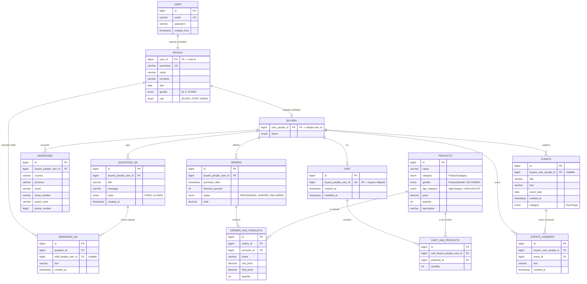

# ER Diagram — SportHub

Diagramma Entità-Relazione ricavato dallo schema Flyway (`V1__CREATE_TABLES.sql`) e verificato per coerenza con le annotazioni JPA presenti nel package `entity`. Notazione: **Mermaid `erDiagram`**.

> Nota sull'ereditarietà: `User → Person → Buyer` è mappata con strategia JPA `@Inheritance(strategy = InheritanceType.JOINED)` (table-per-subclass). A livello relazionale corrisponde a tre tabelle collegate 1:1 da chiave primaria condivisa (PK = FK verso la superclasse): `user` ← `people` ← `buyers`.

## Elenco entità, attributi chiave e note

| Entità (tabella) | PK | Attributi principali | Note |
|---|---|---|---|
| `USER` (`user`) | `id` | email (unique), password, created_time | Radice della gerarchia JPA (`@Inheritance JOINED`) |
| `PEOPLE` (`people`) | `user_id` (= FK a `user.id`) | username (unique), name, surname, dob, gender, role | Estende `User`; `role` default `BUYER` via `@PrePersist` |
| `BUYERS` (`buyers`) | `user_people_id` (= FK a `people.user_id`) | active | Estende `Person`; unico ruolo che può acquistare, aprire Q&A, pubblicare eventi |
| `ADDRESSES` (`addresses`) | `id` | country, province, street, street_number, postal_code, phone_number | N:1 verso `Buyer` |
| `EVENTS` (`events`) | `id` | title, text, event_date, created_at, category (EventType) | N:1 verso `Buyer` (autore); FK nullable con `ON DELETE SET NULL` |
| `EVENTS_ANSWERS` (`events_answers`) | `id` | text, created_at | N:1 verso `Event` (cascade ALL + orphanRemoval lato `Event`) e N:1 verso `Buyer` |
| `QUESTIONS_QA` (`questions_qa`) | `id` | title, message, state (OPEN/CLOSED), created_at | N:1 verso `Buyer` (autore della domanda) |
| `MESSAGES_QA` (`messages_qa`) | `id` | text, created_at | N:1 verso `QuestionQA`; N:1 verso `Person` (staff che risponde, nullable) |
| `CART` (`cart`) | `id` (= FK a `buyers.user_people_id`, `@MapsId`) | created_at, modified_at | Relazione **1:1** con `Buyer` (id condiviso) |
| `PRODUCTS` (`products`) | `id` | name, category, gender, age_category, price, quantity, description | Catalogo, indipendente da Buyer |
| `CART_HAS_PRODUCTS` (`cart_has_products`) | `id` | quantity | Tabella di giunzione N:N tra `Cart` e `Product`, con attributo `quantity` |
| `ORDERS` (`orders`) | `id` | purchase_date, discount_percent, status, total | N:1 verso `Buyer` |
| `ORDERS_HAS_PRODUCTS` (`orders_has_products`) | `id` | name, unit_price, final_price, quantity | Tabella di giunzione N:N tra `Order` e `Product`, con snapshot di nome/prezzo al momento dell'ordine |

## Cardinalità delle relazioni

| Relazione | Cardinalità | Implementazione JPA |
|---|---|---|
| User → Person → Buyer | 1:1 (ereditarietà JOINED) | `@Inheritance(strategy = InheritanceType.JOINED)`, `@PrimaryKeyJoinColumn` |
| Buyer → Address | 1:N | `@OneToMany(mappedBy="buyer")` in `Buyer`, `@ManyToOne` in `Address` |
| Buyer → Event | 1:N | `@OneToMany(mappedBy="buyer")` in `Buyer`, `@ManyToOne` in `Event` |
| Event → EventAnswer | 1:N | `@OneToMany(mappedBy="event", cascade=ALL, orphanRemoval=true)` in `Event`, `@ManyToOne(FetchType.LAZY)` in `EventAnswer` |
| Buyer → EventAnswer | 1:N | `@OneToMany(mappedBy="buyer")` in `Buyer`, `@ManyToOne` in `EventAnswer` |
| Buyer → QuestionQA | 1:N | `@ManyToOne` in `QuestionQA` |
| QuestionQA → MessageQA | 1:N | `@OneToMany(mappedBy="question")` in `QuestionQA`, `@ManyToOne` in `MessageQA` |
| Person(staff) → MessageQA | 1:N | `@ManyToOne` in `MessageQA` (campo `staff`) |
| Buyer → Cart | 1:1 | `@OneToOne @MapsId @JoinColumn(unique=true)` in `Cart` |
| Cart ↔ Product | N:N (via `CartHasProducts`) | `CartHasProducts` con due `@ManyToOne` + colonna `quantity` |
| Buyer → Order | 1:N | `@ManyToOne` in `Order` |
| Order ↔ Product | N:N (via `OrderHasProducts`) | `OrderHasProducts` con due `@ManyToOne` + snapshot prezzo/nome |

## Coerenza codice ↔ schema DB

- Tutte le FK definite in `V1__CREATE_TABLES.sql` trovano corrispondenza in una `@JoinColumn` lato entity (nomi colonna coincidenti, es. `buyers_people_user_id`, `cart_buyers_people_user_id`).
- Le policy `ON DELETE` / `ON UPDATE` (CASCADE, SET NULL) definite in SQL sono gestite a livello di database; a livello applicativo `Event.eventAnswers` replica il comportamento CASCADE tramite `cascade = CascadeType.ALL, orphanRemoval = true`.
- Gli `enum` Java (`Role`, `PersonGender`, `EventType`, `ProductCategory`, `ProductGender`, `AgeCategory`, `OrderStatus`, `QuestionStatus`) sono mappati con `@Enumerated(EnumType.STRING)` e corrispondono 1:1 ai valori `ENUM(...)` definiti in SQL.
- `spring.jpa.hibernate.ddl-auto=validate`: Hibernate **non genera** lo schema, si limita a validarlo contro le entity — lo schema versionato via Flyway è la fonte di verità.
- Nota di manutenzione: l'entità `EventBoard` è presente nel codice ma **commentata/non attiva** (tabella `event_board` non creata in SQL) — non è quindi parte del modello dati effettivo.
