# Diagramma Architetturale Backend — SportHub

Architettura **MVC a livelli** (layered architecture) tipica di un'applicazione Spring Boot monolitica con rendering server-side Thymeleaf.

## Diagramma dei package

```mermaid
flowchart TB
    subgraph CLIENT["Browser (Client)"]
        UI["Thymeleaf Views<br/>(HTML + CSS + JS statico)"]
    end

    subgraph WEB["Livello Web — controllers"]
        C1[AuthenticationController]
        C2[RegistrationController]
        C3[PersonController]
        C4[BuyerController]
        C5[ProductController]
        C6[ProductAdminController]
        C7[CartController]
        C8[OrderController]
        C9[HubController]
        C10[QAController]
        C11[DashboardController]
        C12[ContactsController]
    end

    subgraph SEC["config / security"]
        S1[SecurityConfig]
        S2[JpaUserDetailsService]
        S3[EntityContext]
    end

    subgraph SERVICE["Livello Business — service"]
        SV0[GenericService generic]
        SV1[PersonService]
        SV2[BuyerService]
        SV3[ProductService]
        SV4[CartService]
        SV5[CartHasProductsService]
        SV6[OrderService]
        SV7[OrderHasProductsService]
        SV8[EventService]
        SV9[EventAnswerService]
        SV10[QuestionQAService]
        SV11[MessageQAService]
        SV12[AddressService]
        SV13[UserService]
    end

    subgraph CONV["converters + dto"]
        CV[GenericConverter + N Converter specifici]
        DT[GenericDTO + N DTO Record]
    end

    subgraph REPO["Livello Dati — repository"]
        R1[UserRepository]
        R2[PersonRepository]
        R3[BuyerRepository]
        R4[AddressRepository]
        R5[ProductRepository]
        R6[CartRepository]
        R7[CartHasProductsRepository]
        R8[OrderRepository]
        R9[OrderHasProductsRepository]
        R10[EventRepository]
        R11[EventAnswerRepository]
        R12[QuestionQARepository]
        R13[MessageQARepository]
    end

    subgraph MODEL["Livello Model — entity"]
        E1["GenericEntity + IMappable"]
        E2["User -> Person -> Buyer<br/>(ereditarietà JOINED)"]
        E3[Address, Product, Cart, CartHasProducts]
        E4[Order, OrderHasProducts]
        E5[Event, EventAnswer]
        E6[QuestionQA, MessageQA]
        E7["entity.enums.*"]
    end

    subgraph DB["Database"]
        MYSQL[("MySQL — schema versionato con Flyway<br/>V1__CREATE_TABLES.sql<br/>V2__INSERT_TABLES.sql")]
    end

    UI -->|HTTP GET/POST| WEB
    WEB -->|invoca| SERVICE
    WEB -.->|autenticazione| SEC
    SERVICE --> CONV
    SERVICE -->|usa| REPO
    SEC -->|carica utente| REPO
    REPO -->|Spring Data JPA| MODEL
    MODEL -->|Hibernate/JPA| DB
    SEC -.->|EntityContext costruisce entity da Map| MODEL

    WEB -->|render nome vista| UI
```



## Descrizione dei livelli

| Package | Responsabilità |
|---|---|
| `controllers` | Riceve le richieste HTTP (`@GetMapping`/`@PostMapping`), valida input minimo, delega la logica ai `service`, popola il `Model` per Thymeleaf e restituisce il nome logico della vista (o un `redirect:`). Non contiene logica di business né accesso diretto al DB. |
| `config` | Configurazione trasversale dell'applicazione: `SecurityConfig` (regole di autorizzazione, login/logout, password encoder, CSP), `EntityContext` (bean `@Scope("prototype")` che costruiscono le entity da una `Map<String,String>` tramite `IMappable`). |
| `security` | `JpaUserDetailsService`, adapter tra l'entity `Person` e il contratto `UserDetailsService` richiesto da Spring Security durante il login. |
| `service` | Livello di business logic. Ogni service specifico estende `GenericService<ID, Entity, DTO, Converter, Repository>` che fornisce CRUD generico (`getAll`, `getById`, `save`, `delete`); i service concreti aggiungono metodi di dominio (es. `createOrderFromCart`, `addAnswerToEvent`, `deleteIfAllowed`). Gestisce le transazioni (`@Transactional`) e le regole applicative (es. autorizzazione fine-grained per la cancellazione di un post). |
| `converters` + `dto` | Pattern DTO/Converter per disaccoppiare le entity JPA (persistenza) dai dati scambiati con le view (`record` DTO immutabili + `GenericConverter<D,E>`). |
| `repository` | Interfacce `JpaRepository<Entity, ID>` (Spring Data JPA), con query method derivate (es. `findByEmailIgnoreCase`, `findByCartIdAndProductId`, `findAllByOrderByCreateTimeDesc`). Nessuna logica di business. |
| `entity` (+ `entity.enums`) | Modello di dominio persistente, annotato JPA/Hibernate. Gerarchia `User → Person → Buyer` con `@Inheritance(strategy = InheritanceType.JOINED)`. Interfaccia `IMappable`/`GenericEntity` fornisce mapping riflessivo generico `Map ⇄ Entity` usato da `EntityContext`. |
| `exception` | `GlobalExceptionHandler` per la gestione centralizzata delle eccezioni non catturate a livello controller. |
| `db` (resources) | Migrazioni Flyway (`V1__CREATE_TABLES.sql`, `V2__INSERT_TABLES.sql`): fonte di verità dello schema (Hibernate in modalità `validate`, non genera DDL). |

## Flusso di una richiesta tipica

```
Browser --(HTTP request)--> Controller --(chiamata metodo)--> Service
   --(query/save)--> Repository --(Spring Data JPA/Hibernate)--> Entity --> MySQL
   <--(risultato)-- Repository <--(DTO/Entity)-- Service
Controller --(model.addAttribute + nome vista)--> Thymeleaf --> HTML --> Browser
```

Per le rotte protette, **Spring Security** (`SecurityConfig` + `JpaUserDetailsService`) intercetta la richiesta prima del controller, verifica sessione/ruolo e — se autorizzata — la lascia proseguire; altrimenti reindirizza a `/login` o alla pagina di accesso negato.
