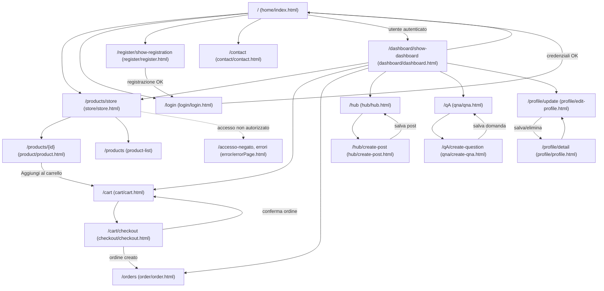

# Schema di Navigazione Frontend — SportHub

Il frontend è realizzato interamente in **Thymeleaf** (server-side rendering), con una struttura a cartelle per feature sotto `src/main/resources/templates/`. Ogni cartella contiene una o più view, affiancate dal proprio `style.css`/`script.js` in `src/main/resources/static/`.

## Mappa delle pagine principali

## Differenze di navigazione User (Buyer) vs Staff/Admin

Le view **non sono duplicate** per ruolo: la stessa pagina Thymeleaf mostra blocchi diversi tramite `sec:authorize` (libreria `thymeleaf-extras-springsecurity6`), seguendo un pattern di **template riutilizzabile con contenuto condizionale**.

| Pagina | Comportamento Guest (`isAnonymous()`) | Comportamento Buyer autenticato | Comportamento Staff/Admin |
|---|---|---|---|
| Navbar (home, store, product, cart, checkout, order) | Mostra link "Login" / "Registrati" | Mostra link a Dashboard, Carrello, Ordini, Hub, Q&A, Logout | Come Buyer (stessa navbar, ruolo non incide sulla navbar globale) |
| `qna/qna.html` | Vede le domande e risposte pubblicate | Può creare una nuova domanda (`/qA/create-question`) | Vede in più, per ogni domanda, il **pannello di risposta** (`sec:authorize="hasAnyRole('STAFF','ADMIN')"`) e il pulsante di **cancellazione domanda** |
| `hub/hub.html` | Consultazione post (in base a config sicurezza `/hub` non è tra i path pubblici → richiede login) | Può creare eventi, rispondere, cancellare **i propri** post (verifica lato service `EventService.deleteIfAllowed`) | Può cancellare **qualsiasi** post (stessa route, autorizzazione applicativa via `Authentication`) |
| Catalogo prodotti (`/admin/products/**`) | Nessun accesso (non esposto in UI) | Nessun accesso a form di gestione prodotto | Le operazioni di save/update/delete prodotto sono esposte solo tramite form POST dedicati, non presenti nella navigazione Buyer |
| `/post/delete` | — | — | Riservato a `ROLE_ADMIN` (regola `SecurityConfig`) |

> Nota: a differenza di un pattern con dashboard Admin separata, SportHub adotta un'unica base di template e discrimina le azioni sensibili tramite direttive `sec:authorize` a livello di frammento HTML e tramite `@PreAuthorize`/regole in `SecurityConfig` a livello di controller. Non esiste, allo stato attuale, un'area `/admin` con viste HTML dedicate: la gestione prodotti da parte dell'Admin avviene tramite gli endpoint di `ProductAdminController`.

## Template e risorse riutilizzabili

- Ogni feature ha una coppia `template/<feature>/<pagina>.html` + `static/<feature>/style.css` (+ `script.js` dove serve interattività, es. `login`, `register`, `dashboard`, `store`, `home`).
- Il blocco di navbar/header (con logo, link e blocco `sec:authorize`) è ripetuto in modo coerente in tutte le pagine principali (`home`, `store`, `product`, `cart`, `checkout`, `order`) — nel progetto attuale è duplicato per pagina piuttosto che estratto in un `th:fragment` condiviso; è un punto di miglioramento architetturale segnalato in `docs/architecture.md`.
- Pagina di errore condivisa: `error/errorPage.html`, restituita da tutti i controller nei blocchi `catch` e da Spring Security per `/accesso-negato`.
