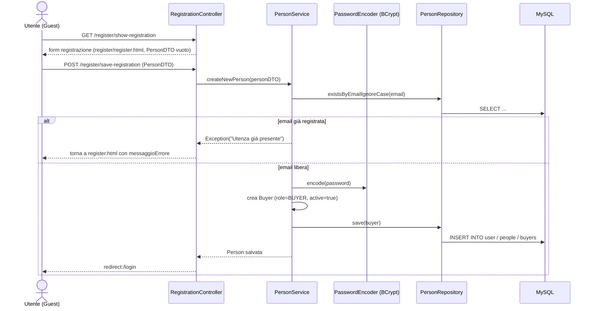
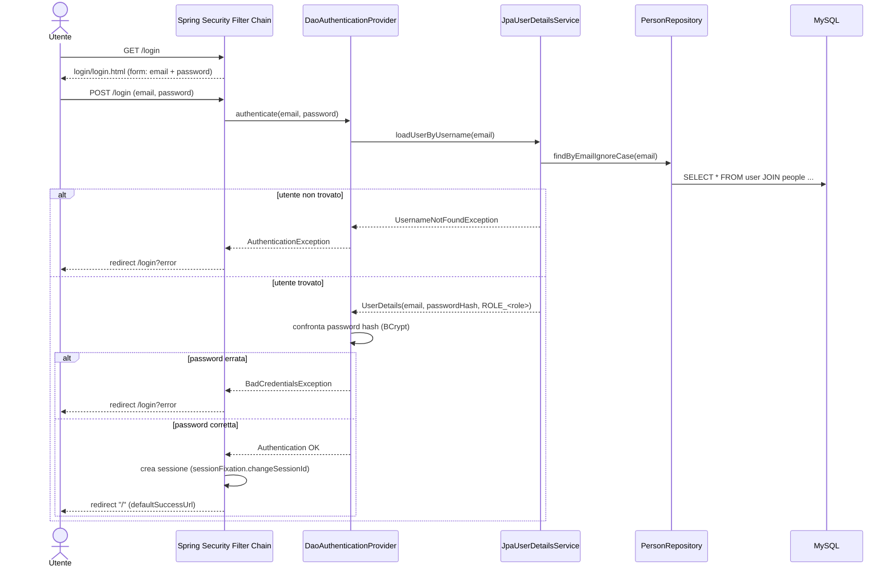
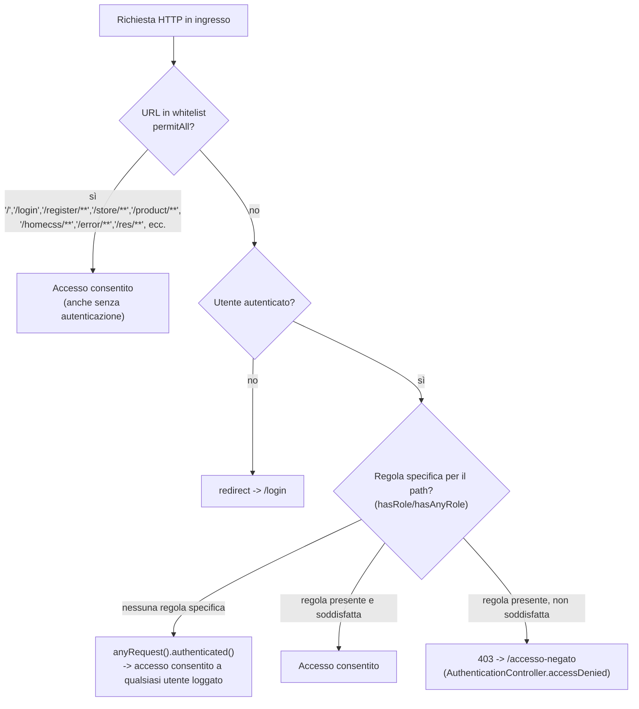

# Flusso di Autenticazione — SportHub

Il sistema di autenticazione si basa su **Spring Security** con form-login classico (sessione HTTP, cookie `JSESSIONID`), `DaoAuthenticationProvider` e `UserDetailsService` custom che legge gli utenti dal database tramite JPA.

## 1. Registrazione

Note:
- Il ruolo di default è **BUYER** (assegnato sia esplicitamente in `PersonService.createNewPerson`, sia come fallback in `Person.initializeRole()` via `@PrePersist`).
- La password non viene mai salvata in chiaro: `PasswordEncoder` (Bcrypt strength 12, tramite `DelegatingPasswordEncoder`) la codifica prima del salvataggio.
- Ogni nuovo Buyer viene creato con `active = true`.

## 2. Login e caricamento del ruolo

Punti chiave dell'implementazione (`SecurityConfig` + `JpaUserDetailsService`):

- **Username parameter**: il form di login usa il campo `email` (`.usernameParameter("email")`) come identificativo, non uno `username` separato.
- **Caricamento ruolo**: `JpaUserDetailsService.loadUserByUsername` recupera l'entity `Person` e costruisce un `UserDetails` di Spring Security con `.roles(person.getRole().name())`, che Spring traduce internamente in un'autorità `ROLE_<NOME>` (es. `ROLE_BUYER`, `ROLE_STAFF`, `ROLE_ADMIN`).
- **Password matching**: `DaoAuthenticationProvider` usa il `PasswordEncoder` (BCrypt) per confrontare la password in chiaro inviata dal form con l'hash salvato in `user.password`.
- **Sessione**: alla login riuscita, Spring Security rigenera l'id di sessione (`sessionFixation().changeSessionId()`) per prevenire session fixation.

## 3. Redirect in base al ruolo

Nel progetto attuale **non esiste un redirect differenziato per ruolo** dopo il login: `defaultSuccessUrl("/", true)` riporta sempre alla home, indipendentemente dal ruolo (`BUYER`, `STAFF`, `ADMIN`). La differenziazione avviene **a valle**, a livello di singola pagina/azione:

- la navbar e le pagine mostrano/nascondono blocchi con `sec:authorize="hasAnyRole('STAFF','ADMIN')"` (es. pannello di risposta nel Q&A);
- le azioni sensibili sono protette a livello di endpoint tramite `@PreAuthorize` (es. `QAController.addAnswer`, `QAController.deleteQuestion`) o tramite regole dichiarate in `SecurityConfig` (`.requestMatchers(...).hasRole("ADMIN")` per `/post/delete`, `.hasAnyRole("ADMIN","STAFF")` per `POST /qA/delete-question`);
- alcune autorizzazioni sono verificate **programmaticamente nel service** (es. `EventService.deleteIfAllowed`, che consente la cancellazione di un evento solo al proprietario oppure a Staff/Admin).

## 4. Protezione delle pagine

Regole esplicite definite in `SecurityConfig.securityFilterChain`:

| Pattern URL / metodo | Regola |
|---|---|
| `/`, `/login`, `/accesso-negato`, `/homecss/**`, `/error`, `/home/index`, `/store/**`, `/login/**`, `/error/**`, `/product/**`, `/register/**`, `/resources/**`, `/css/**`, `/js/**`, `/res/**`, `/favicon.ico` | `permitAll()` — pubblici |
| `/post/delete` | `hasRole("ADMIN")` |
| `POST /qA/delete-question` | `hasAnyRole("ADMIN","STAFF")` |
| qualsiasi altra richiesta | `authenticated()` — richiede login, nessun vincolo di ruolo aggiuntivo a livello di filtro (i vincoli fini sono nei controller via `@PreAuthorize` o logica di service) |

Altre misure di sicurezza attive:
- **CSRF** abilitato (default Spring Security).
- **Content-Security-Policy** custom (`default-src 'self'`, `script-src 'self' 'unsafe-inline'`, whitelisting di font/stili esterni).
- **Logout**: `POST /logout` invalida la sessione, cancella l'autenticazione e il cookie `JSESSIONID`, redirige a `/login?logout`.
- **Accesso negato**: `.exceptionHandling().accessDeniedPage("/access-denied")` gestito da `AuthenticationController.accessDenied()` → vista `error/errorPage.html`.
