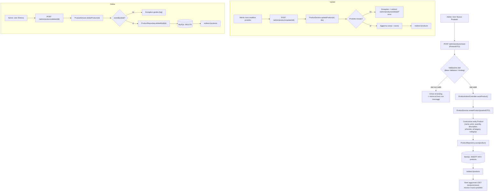
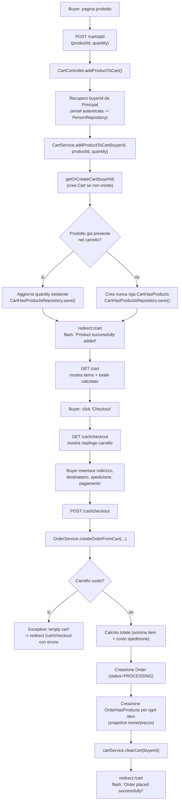
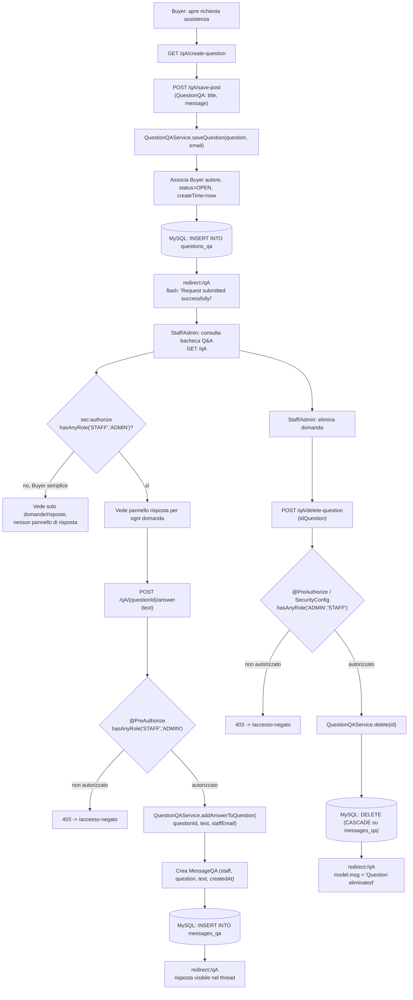
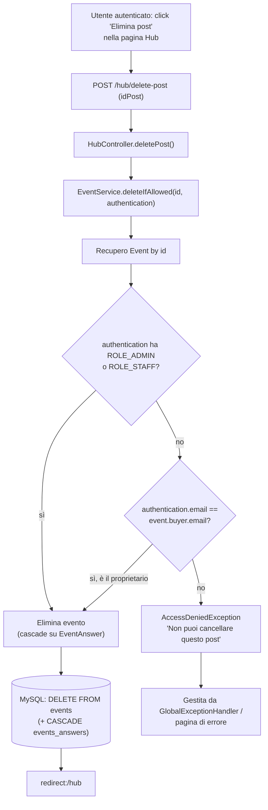

# Diagramma dei Flussi Principali — SportHub

Questo documento presenta almeno un flow chart per ciascuna categoria richiesta: **CRUD generico**, **azione utente (Buyer)** e **azione admin/staff**.

## 1. Flusso CRUD — Gestione Prodotto (Admin)

Esempio di flusso CRUD completo: creazione, validazione, servizio, repository, redirect, messaggio d'esito. Riferimento: `ProductAdminController` + `ProductService` + `ProductRepository`.

## 2. Azione Utente (Buyer) — Aggiunta al Carrello e Checkout

## 3. Azione Admin/Staff — Gestione Q&A (risposta e moderazione)

## 4. Flusso trasversale — Moderazione Hub Eventi (proprietario vs Admin/Staff)

Esempio aggiuntivo che mostra come una stessa azione (cancellazione) sia autorizzata sia per il Buyer proprietario, sia per ruoli privilegiati, tramite verifica applicativa nel service.

